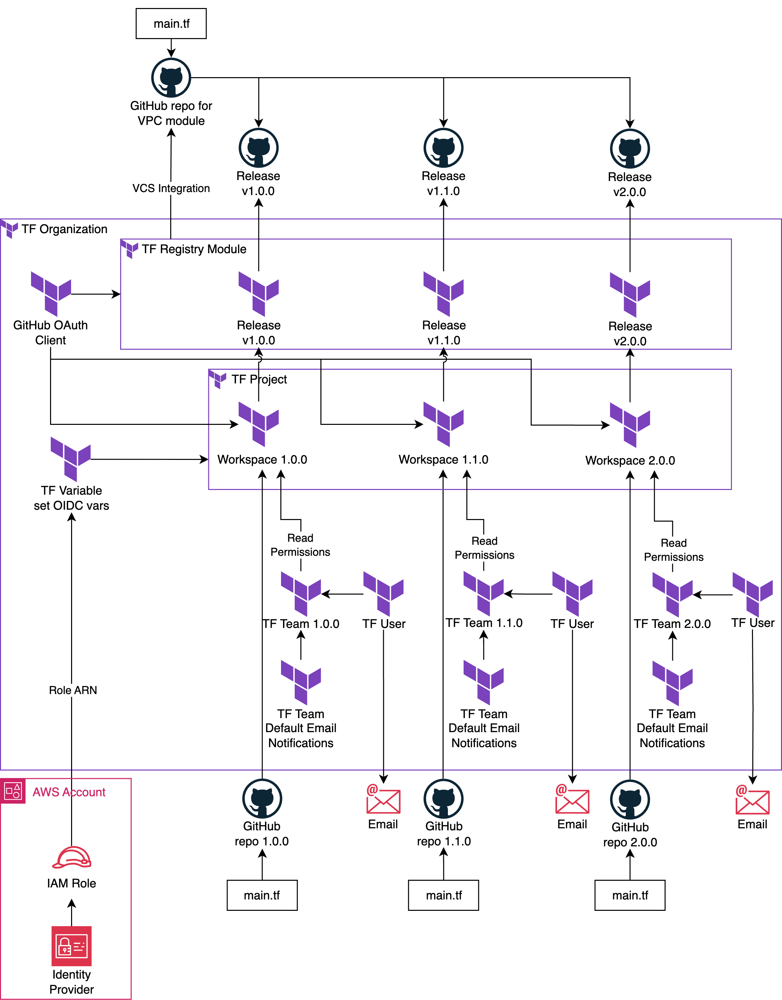
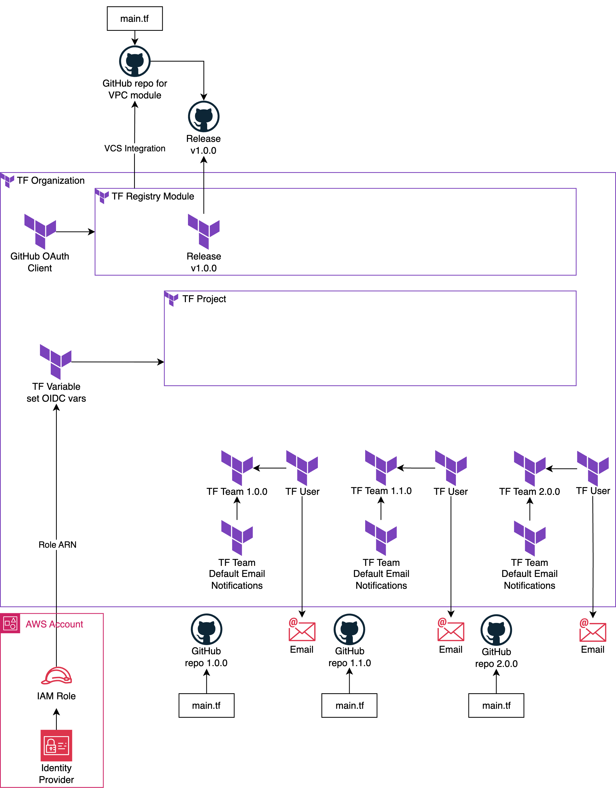

# HashiTalks Terraform Module Lifecycle demo bootstrap

This repository bootstraps the demo for the HashiTalks session on managing module lifecycle.

# 1. Architecture

Target architecture after full demo



Bootstrapped architecture after running terraform apply



# 2. Deployment

Step 1: Configure AWS credentials. For example:

```bash
export AWS_ACCESS_KEY_ID=example
export AWS_SECRET_ACCESS_KEY=example
export AWS_SESSION_TOKEN=example
```

Step 2: Configure HCP Terraform credentials. Refer to the [tfe_provider authentication docs](https://registry.terraform.io/providers/hashicorp/tfe/latest/docs#authentication) for the various token options and guidance. For example:

```bash
export TFE_TOKEN=example
```

Step 3: In the [tf](./tf/) directory, copy [tf/terraform.tfvars.example](./tf/terraform.tfvars.example) to `terraform.tfvars` and change the environment variables accordingly.

- `organization_membership_email_workspace_v1_0_0`, `organization_membership_email_workspace_v1_1_0`, `organization_membership_email_workspace_v2_0_0`: Uses email aliasing to simulate different Terraform Team members who receive notification for different workspaces that they manage
- `github_token`: GitHub credentials can use a [personal access tokens](https://docs.github.com/en/authentication/keeping-your-account-and-data-secure/managing-your-personal-access-tokens). This token needs sufficient permissions to create, delete repositories, and write files to the repository.

Step 4: In the [tf](./tf/) directory, run an apply, review the plan output, and approve the plan accordingly.

```bash
terraform init
terraform apply
```
